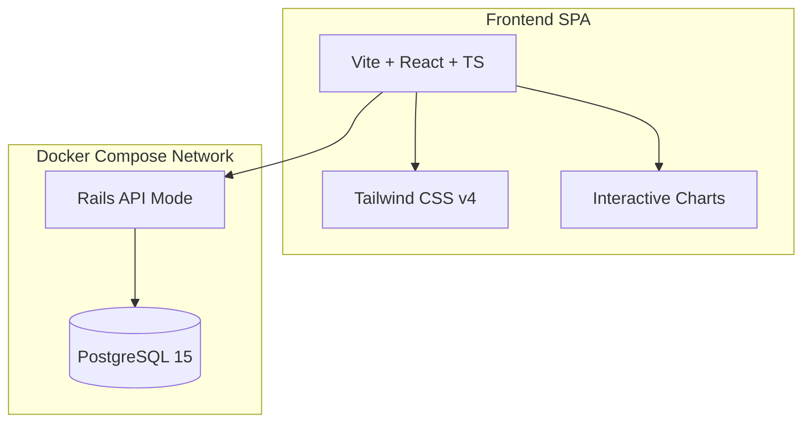

# Architectural Design Notes & Technical Stack

This document captures the planning, stack decisions, and architectural diagrams I established at the beginning of the project to build a highly optimized Salary Management Portal.

---

## 1. System Architecture

The solution utilizes a decoupled, containerized client-server topology managed via Docker Compose:



* **Multi-Container Separation**: Running isolated service networks ensures the database (`db`), backend service (`api`), and user interface (`web`) are horizontally scalable and easy to deploy.
* **API Rate-Limiting**: I integrated `rack-attack` middleware globally in the Rails pipeline to throttle excessive client requests, protecting resource endpoints from brute-force queries.

---

## 2. Database Schema & Query Index Tuning

For an organization containing 10,000+ employees, payroll queries and metrics calculations can suffer from scaling bottlenecks. I designed the `employees` schema to balance full CRUD capabilities with sub-second analytical reporting.

### Relational Schema (`employees` Table)

| Column Name | Data Type | Constraints / Details |
| :--- | :--- | :--- |
| `id` | Bigint | Primary Key (Auto-incrementing) |
| `full_name` | String | `null: false` |
| `email` | String | `null: false, unique: true` (Valid format validation) |
| `job_title` | String | `null: false` |
| `department` | String | `null: false` (Engineering, Sales, HR, etc.) |
| `employment_type` | String | `null: false` (Enum: Full-time, Part-time, Contract) |
| `country` | String | `null: false` |
| `salary` | Decimal | `null: false`, precision: 12, scale: 2 (Constraint: salary > 0) |
| `created_at` | DateTime | `null: false` |
| `updated_at` | DateTime | `null: false` |

### Index-Only Query Optimization
The HR dashboard requests aggregate payroll insights grouped by country, job title, and department. To prevent slow table scans that scale linearly with the table size, I engineered specific composite indexes:
1. **`[:country, :job_title, :salary]`**: Converts country-specific job title salary queries into milliseconds-fast **index-only scans** directly inside memory buffers.
2. **`[:department, :salary]`**: Speeds up department budget allocation calculations.
3. **`[:employment_type, :salary]`**: Speeds up payroll percentage breakdowns.

---

## 3. High-Performance Bulk Seeding Strategy

A key requirement in the assessment instructions is to generate **10,000 realistic employees** using combinations of `first_names.txt` and `last_names.txt` files, while maintaining high performance since engineers run the script regularly.

### The Bottleneck
Standard ActiveRecord creations inside a loop:
```ruby
10000.times { Employee.create!(...) }
```
This requires 10,000 database roundtrips, individual SQL validation callbacks, and trigger bindings, taking minutes to complete.

### The Solution
I implemented a batched bulk-insertion mechanism in `db/seeds.rb`:
* The script reads name files, samples combinations, constructs a list of raw attribute hashes, and utilizes ActiveRecord's `insert_all!` in slices of 2,500.
* **Performance Benchmark**: Successfully seeds **10,000 records in 0.6 seconds** inside the container database.
